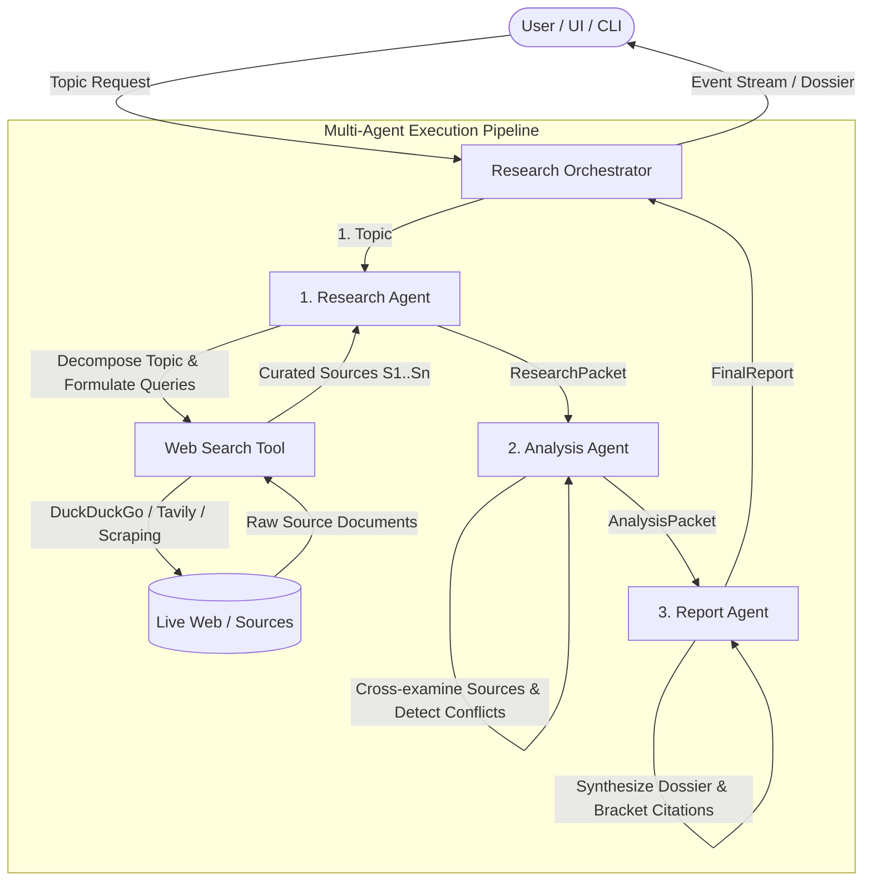
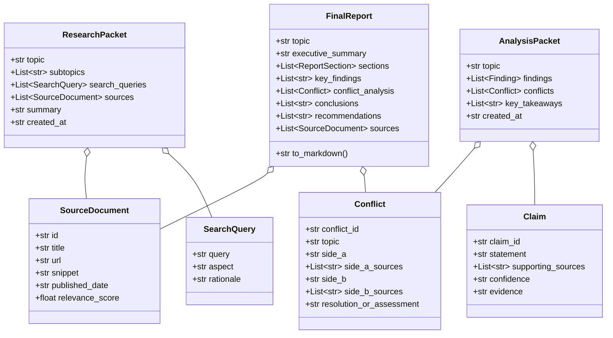

# System Architecture: Multi-Agent Research Assistant

This document outlines the architectural design, agent interaction protocols, data contracts, and implementation specifications for the **Multi-Agent Research Assistant**.

---

## 1. System Overview

The Multi-Agent Research Assistant is an autonomous, multi-agent intelligence platform designed to decompose complex inquiry topics, execute multi-source external web investigations, rigorously cross-examine claims and contradictions, and synthesize publication-ready research dossiers with inline citations.

---

## 2. Agent Responsibilities & Protocols

### A. Orchestrator (`src/orchestrator.py`)
- **Role**: Coordinates pipeline progression, manages intermediate states, logs progress, and emits event callbacks for UI streaming.
- **Inputs**: User research prompt (`str`), execution parameters (`save_output`, `output_path`).
- **Outputs**: `FinalReport` object and saved Markdown dossier on disk (`./reports/`).
- **Guarantees**: Enforces sequential integrity: ensures `ResearchPacket` is validated before triggering `Analysis Agent`, and validates `AnalysisPacket` before invoking `Report Agent`.

### B. 1. Research Agent (`src/agents/research_agent.py`)
- **Role**: Dissects abstract queries into actionable investigative angles and retrieves corroborating sources.
- **Key Tasks**:
  1. Breaks the query into 3–4 thematic dimensions (Technical foundations, Market adoption, Regulatory challenges, Future outlook).
  2. Formulates precise search queries for each dimension.
  3. Queries external web backends via `WebSearchTool`.
  4. Deduplicates URLs, scores source relevance, and assigns deterministic source identifiers (`[S1]`, `[S2]`, ...).
- **Data Contract Produced**: `ResearchPacket`.

### C. 2. Analysis Agent (`src/agents/analysis_agent.py`)
- **Role**: Cross-references raw sources to extract substantiated claims, grade confidence, and identify opposing viewpoints.
- **Key Tasks**:
  1. Corroborates claims across multiple sources.
  2. Detects explicit conflicts or disputed projections (e.g., rapid commercialization timelines vs regulatory stagnation).
  3. Evaluates evidence quality and assigns confidence levels (`High`, `Medium`, `Low`).
  4. Formulates core strategic takeaways.
- **Data Contract Produced**: `AnalysisPacket`.

### D. 3. Report Agent (`src/agents/report_agent.py`)
- **Role**: Synthesizes verified findings and source bibliographies into an executive research dossier.
- **Key Tasks**:
  1. Drafts a high-impact Executive Summary.
  2. Generates thematic analysis sections incorporating bracket citations (e.g., `[S1]`, `[S2]`).
  3. Compiles a Conflict & Controversy matrix with neutral evaluations.
  4. Formulates actionable strategic recommendations and conclusions.
  5. Assembles a complete bibliography mapping each source ID to title, URL, snippet, and relevance rating.
- **Data Contract Produced**: `FinalReport`.

---

## 3. Data Contracts & Schema Specification

All inter-agent communication is governed by typed Pydantic v2 schemas (`src/models.py`):

---

## 4. Dual-Mode Architecture (Live API + High-Fidelity Mock)

To ensure zero friction during local development, offline evaluations, and demos:
1. **Live Mode**:
   - Integrates with OpenAI-compatible APIs (OpenAI, Groq, Together, Ollama) via `src/llm.py`.
   - Executes live searches via DuckDuckGo (HTML parser or `duckduckgo-search`) or Tavily.
2. **Mock Mode (Built-In Fallback)**:
   - Activated automatically if no API keys are provided or when `--mock` is flagged.
   - Generates topic-aware decomposition, claim corroboration, conflict modeling, and citations with zero latency and zero external dependencies.

---

## 5. Event-Driven UI Streaming

The orchestrator and all agents accept an optional `on_event: Callable[[AgentEvent], None]` callback:
- Emits structured events (`agent`, `step`, `status`, `message`, `data`).
- Both the Streamlit dashboard (`src/ui/app.py`) and the CLI (`src/main.py`) subscribe to these events for real-time visual progress indication and intermediate artifact inspection.
