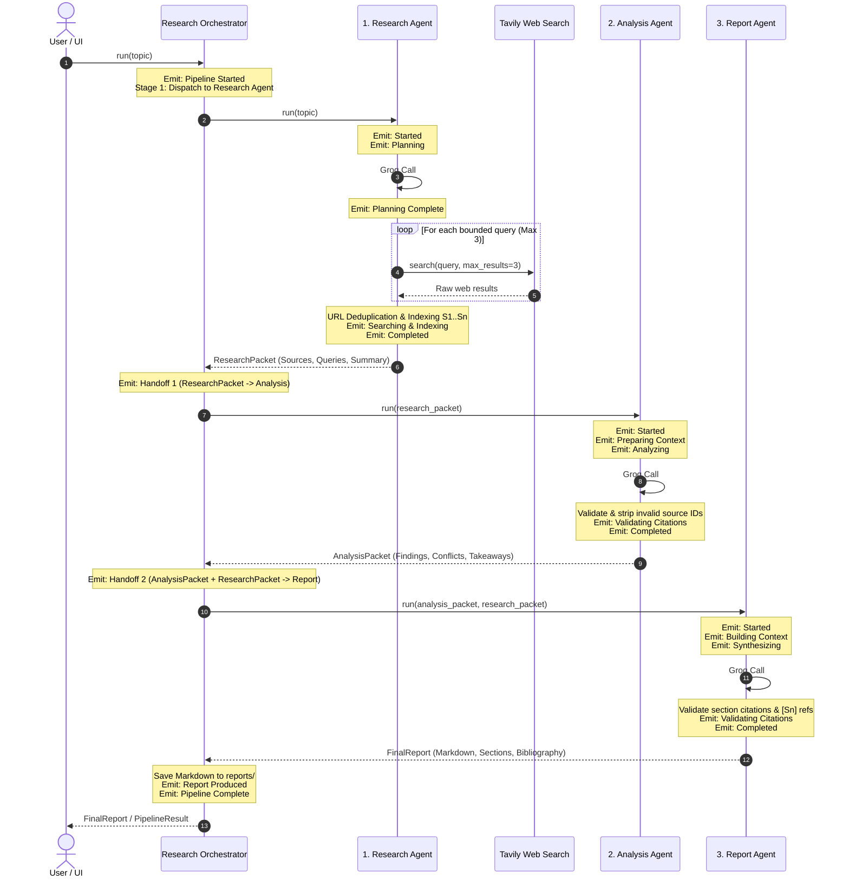
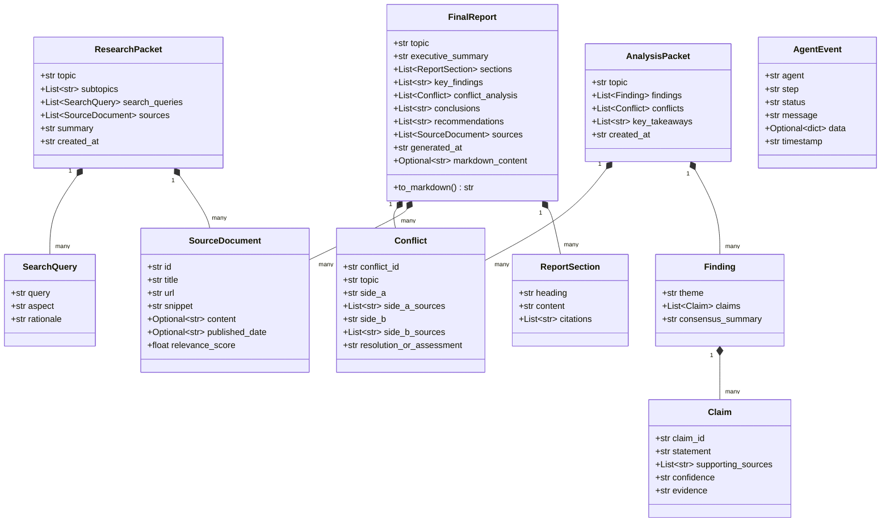

# System Architecture: Multi-Agent Research Assistant

This document outlines the architectural specifications, agent interaction protocols, data contracts, and citation validation mechanics for the **Multi-Agent Research Assistant**.

---

## 1. System Overview

The Multi-Agent Research Assistant is an autonomous multi-agent intelligence platform designed to transform an open-ended research question into an executive-ready, citation-backed research dossier. 

Rather than relying on a single monolithic LLM prompt, the system segregates responsibilities across three isolated agents governed by a centralized Orchestrator:
- **Research Agent**: Evidence Collector (Topic decomposition & live web search).
- **Analysis Agent**: Evidence Examiner (Claim corroboration, conflict detection & citation validation).
- **Report Agent**: Evidence Synthesizer (Executive brief, narrative sections & dossier compilation).

### Core Architectural Principles
1. **Zero Fabrication**: No synthetic search results or mock fallbacks. If an API key or query fails, the pipeline aborts cleanly with explicit errors.
2. **Strict Provider Specialization**: Locked to **Groq** (`qwen/qwen3.8-27b`) for sub-second inference and **Tavily** for focused web search.
3. **Rigid Inter-Agent Contracts**: Typed Pydantic v2 schemas govern every boundary.
4. **Deterministic Orchestration**: Agents never communicate directly; the Orchestrator owns all transitions and telemetry.
5. **Fixed Resource Budget**: Exactly 3 Groq calls per pipeline run and bounded Tavily queries (max 3 queries × 3 results).

---

## 2. End-to-End Orchestrated Pipeline Flow



---

## 3. The 22-Stage Event Stream & Visible Handoffs

The Orchestrator and agents record every execution phase into an ordered list of typed `AgentEvent` objects. A standard complete run produces the following 22-stage event stream:

| # | Emitter | Step Name | Status | Purpose / Description |
|---|---|---|---|---|
| **1** | Orchestrator | Pipeline Started | `started` | Pipeline initialized with user research topic |
| **2** | Orchestrator | Stage 1 | `running` | Dispatching topic to Research Agent |
| **3** | Research Agent | Started | `started` | Evidence collector activated |
| **4** | Research Agent | Planning | `running` | Groq Call #1: Decomposing topic into subtopics & queries |
| **5** | Research Agent | Planning Complete | `running` | 3 targeted queries formulated |
| **6** | Research Agent | Searching | `running` | Executing live searches via Tavily (max 3x3) |
| **7** | Research Agent | Indexing | `running` | Deduplicating URLs and assigning sequential IDs (`S1`..`Sn`) |
| **8** | Research Agent | Completed | `completed` | ResearchPacket compiled with real sources |
| **9** | Orchestrator | Handoff 1 | `running` | **Visible Handoff**: ResearchPacket passed to Analysis Agent |
| **10** | Analysis Agent | Started | `started` | Evidence examiner activated |
| **11** | Analysis Agent | Preparing Context | `running` | Formatting source snippets for LLM input |
| **12** | Analysis Agent | Analyzing | `running` | Groq Call #2: Cross-source examination & claim extraction |
| **13** | Analysis Agent | Validating Citations | `running` | Verifying cited source IDs exist in ResearchPacket |
| **14** | Analysis Agent | Completed | `completed` | AnalysisPacket compiled with validated findings & conflicts |
| **15** | Orchestrator | Handoff 2 | `running` | **Visible Handoff**: Analysis + Research packets passed to Report Agent |
| **16** | Report Agent | Started | `started` | Evidence synthesizer activated |
| **17** | Report Agent | Building Context | `running` | Organizing findings, conflicts & source references |
| **18** | Report Agent | Synthesizing | `running` | Groq Call #3: Drafting summary, narrative sections & recs |
| **19** | Report Agent | Validating Citations | `running` | Validating section citations and `[Sn]` brackets in prose |
| **20** | Report Agent | Completed | `completed` | FinalReport compiled and Markdown rendered |
| **21** | Orchestrator | Report Produced | `running` | Validating dossier metrics & persisting to disk |
| **22** | Orchestrator | Pipeline Complete | `completed` | Full workflow finished successfully |

---

## 4. Agent Specialization & Boundaries

```
┌─────────────────────────────────────────────────────────────────────────────┐
│                            RESEARCH AGENT                                   │
│                        Role: Evidence Collector                             │
├─────────────────────────────────────────────────────────────────────────────┤
│ • Ingests: Research topic string                                            │
│ • LLM Calls: Exactly 1 (Groq JSON mode, max_tokens=800)                     │
│ • External I/O: Tavily Search API (max 3 queries × 3 results)               │
│ • Responsibilities:                                                         │
│   - Topic decomposition into 3 inquiry angles                               │
│   - URL deduplication across searches                                       │
│   - Sequential source indexing (S1, S2, ...)                                │
│ • Boundary Guarantee: Does NOT analyze or synthesize findings               │
│ • Produces: ResearchPacket                                                  │
└─────────────────────────────────────────────────────────────────────────────┘
                                      │
                                      ▼
┌─────────────────────────────────────────────────────────────────────────────┐
│                            ANALYSIS AGENT                                   │
│                         Role: Evidence Examiner                             │
├─────────────────────────────────────────────────────────────────────────────┤
│ • Ingests: ResearchPacket                                                   │
│ • LLM Calls: Exactly 1 (Groq JSON mode, max_tokens=900)                     │
│ • External I/O: None (operates strictly on collected evidence)              │
│ • Responsibilities:                                                         │
│   - Corroborates claims across multiple sources                             │
│   - Evaluates confidence (High, Medium, Low)                                │
│   - Detects explicit contradictions and disputes between sources            │
│   - Strips any hallucinated source IDs not present in ResearchPacket        │
│ • Boundary Guarantee: Does NOT perform web search; does NOT write reports   │
│ • Produces: AnalysisPacket                                                  │
└─────────────────────────────────────────────────────────────────────────────┘
                                      │
                                      ▼
┌─────────────────────────────────────────────────────────────────────────────┐
│                             REPORT AGENT                                    │
│                       Role: Evidence Synthesizer                            │
├─────────────────────────────────────────────────────────────────────────────┤
│ • Ingests: AnalysisPacket + ResearchPacket                                  │
│ • LLM Calls: Exactly 1 (Groq JSON mode, max_tokens=900)                     │
│ • External I/O: None                                                        │
│ • Responsibilities:                                                         │
│   - Drafts executive summary, thematic sections, conclusions & recommendations│
│   - Attaches bracket citations ([S1], [S2]) directly in text body           │
│   - Audits all citations against ResearchPacket bibliography                │
│   - Pre-renders full GitHub Flavored Markdown document                      │
│ • Boundary Guarantee: Does NOT fetch new information or alter analysis      │
│ • Produces: FinalReport                                                     │
└─────────────────────────────────────────────────────────────────────────────┘
```

---

## 5. Data Contracts & Pydantic v2 Specifications

All inter-agent communication is governed by typed schemas defined in `src/models.py`:



---

## 6. Citation Integrity Architecture

To prevent citation hallucination, the system implements a three-tier validation mechanism:

```
[Live Web Results via Tavily]
             │
             ▼
   [WebSearchTool.search()]
   • Deduplicates URLs
   • Programmatically assigns ID: S1, S2, ... Sn
             │
             ▼
      [ResearchPacket]
      Valid ID Set = {"S1", "S2", ... "Sn"}
             │
             ├────────────────────────────────────────┐
             ▼                                        ▼
    [Analysis Agent]                           [Report Agent]
    • Receives Valid ID Set                    • Receives Valid ID Set
    • LLM outputs claims with sources          • LLM outputs sections with [Sn]
    • Validation:                              • Validation:
      - Strips IDs ∉ Valid ID Set                - Strips section citations ∉ Valid Set
      - Prunes claims with 0 valid sources       - Scans prose for regex r'\[S\d+\]'
                                                 - Cross-references against Valid Set
             │                                        │
             └───────────────────┬────────────────────┘
                                 │
                                 ▼
                           [FinalReport]
           • Pre-rendered Markdown with footnotes
           • Full References bibliography
           • 100% verified source traceability
```

---

## 7. Resource Constraints & API Budget

| Component | Target Budget | Enforcement Mechanism |
|---|---|---|
| **Research Agent LLM** | Exactly 1 Groq call | `json_mode=True`, `max_tokens=800` |
| **Web Search Retrieval** | Max 3 queries × 3 results | `MAX_SEARCH_QUERIES=3`, `MAX_RESULTS_PER_QUERY=3` |
| **Analysis Agent LLM** | Exactly 1 Groq call | `json_mode=True`, `max_tokens=900` |
| **Report Agent LLM** | Exactly 1 Groq call | `json_mode=True`, `max_tokens=900` |
| **Orchestrator LLM** | Exactly 0 Groq calls | Deterministic Python coordination logic |
| **Total Pipeline Calls** | **3 Groq calls + 3 Tavily searches** | Enforced by architecture, verified in Layer 4 test |

Token limits (800–900) guarantee compliance with Groq on-demand free-tier constraints (1,000 Output Tokens Per Minute) during sequential execution.
